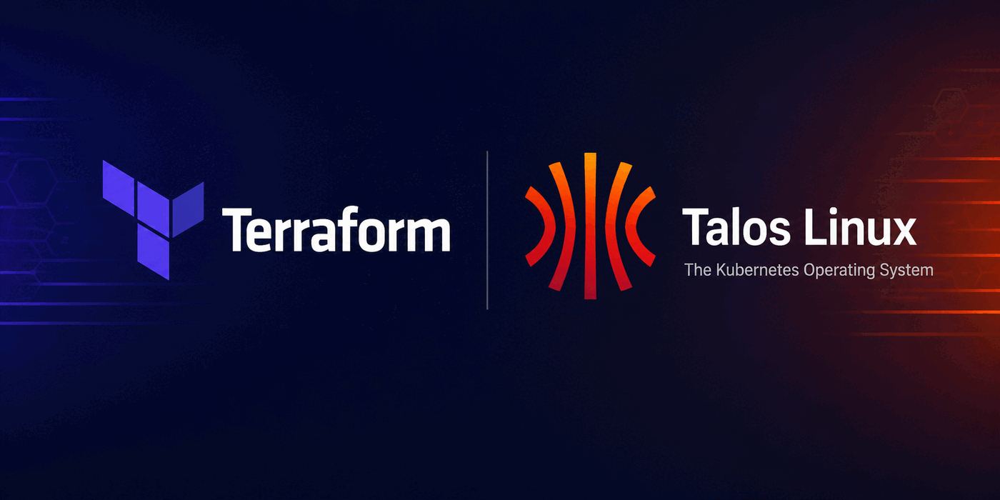
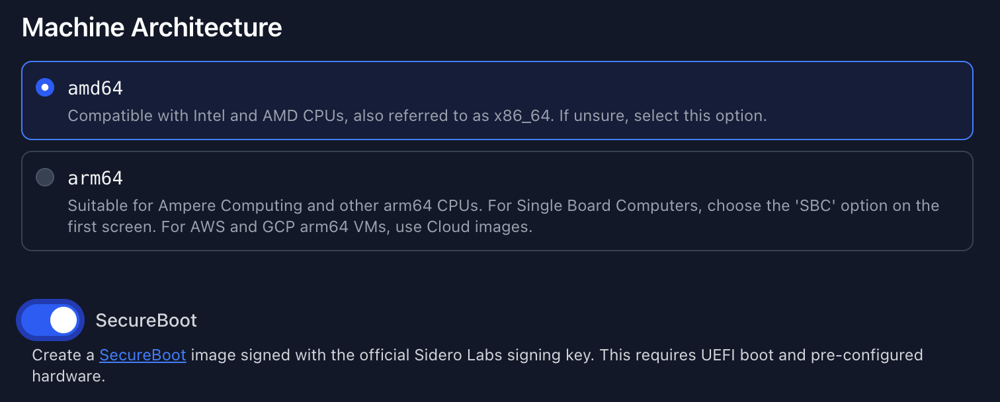

<!-- markdownlint-disable MD041 -->


<!-- markdownlint-enable MD041 -->

# Terraform Talos Cluster

<!-- [](https://registry.terraform.io/modules/ThiagoFanfoni/talos-cluster/talos/latest) -->

<!-- [](https://github.com/ThiagoFanfoni/terraform-talos-cluster/actions/workflows/release.yaml) -->

[](https://developer.hashicorp.com/terraform/install)
<!-- [](./LICENSE) -->

Terraform module for configuring and managing Talos Linux clusters.

This module does not create Talos boot media or installer images. You must
provide an installer image reference for each node. The
[bare-metal Secure Boot example](./examples/bare-metal-secure-boot) shows how
to obtain one from the Talos Image Factory.

## Secure Boot setup

> This Secure Boot setup is recommended only for bare-metal deployments. For
> virtual machines, use the Secure Boot mechanism provided by the hypervisor or
> cloud platform instead of following this firmware-enrollment procedure.

Secure Boot requires both the bootable ISO and the installer image to be Secure
Boot variants. When generating the artifacts with the
[Talos Image Factory](https://factory.talos.dev/), enable **SecureBoot** as
shown below. The Image Factory signs both artifacts with the official Sidero
Labs Secure Boot key.



### Automatic key enrollment

Before booting the ISO for the first time, configure the machine's UEFI firmware:

1. Enable UEFI boot and disable Legacy or CSM boot.
2. Enable Secure Boot and put it into setup mode. Depending on the firmware,
   this option may be named **Reset to Setup Mode**, **Clear Secure Boot keys**,
   or similar.
3. Save the settings and boot the Secure Boot ISO from the USB drive.
4. If key enrollment does not start automatically, press `Esc`
   to open the Talos boot menu and select **Enroll Secure Boot keys: auto**.
5. Allow the machine to reboot, then boot the ISO again. Talos should start in
   maintenance mode with Secure Boot enabled.

> Clearing the Secure Boot variables removes previously enrolled keys,
> including vendor and operating-system keys. Only clear them on machines
> dedicated to Talos, or restore every key required by other operating systems.

### Manual firmware enrollment

Use manual enrollment only when the automatic Talos boot-menu option does not
work. Secure Boot stores its keys in authenticated UEFI variables. In the
firmware's Secure Boot key-management screen, browse the USB drive for the
files under `loader/keys/auto` and enroll them in the following order:

| UEFI variable                | File       | File type              |
| ---------------------------- | ---------- | ---------------------- |
| Authorized Signatures (`db`) | `db.auth`  | Authenticated Variable |
| Key Exchange Keys (`KEK`)    | `KEK.auth` | Authenticated Variable |
| Platform Key (`PK`)          | `PK.auth`  | Authenticated Variable |

Select **Authenticated Variable** when the firmware asks how to interpret each
file. These `.auth` files are authenticated UEFI variable-update payloads, not
ordinary certificate files. Enroll `PK.auth` last because setting the Platform
Key takes the firmware out of setup mode. Do not modify Forbidden Signatures
(`dbx`); it is a revocation database, and the Talos ISO does not provide a key
to enroll there.

Verify Secure Boot while the node is in maintenance mode:

```shell
talosctl --nodes <node-address> get securitystate --insecure
```

The `SECUREBOOT` value must be `true`. Configure the node with a Secure Boot
installer image reference. Every installer image used for a later Talos upgrade
must also be a Secure Boot variant signed by a key trusted by the `db` variable.
Otherwise, the firmware may reject the installed system after it reboots.

See the official
[Talos SecureBoot documentation](https://docs.siderolabs.com/talos/latest/platform-specific-installations/bare-metal-platforms/secureboot)
for more information, including custom-key workflows.

## Configure kubectl and talosctl

After deploying the cluster, you can save the module's client configuration
outputs to the default locations used by `kubectl` and `talosctl`:

```bash
terraform output -raw talosconfig > ~/.talos/config
terraform output -raw kubeconfig > ~/.kube/config
```

<!-- BEGIN_TF_DOCS -->
<!-- markdownlint-disable -->
## Requirements

| Name | Version |
| ---- | ------- |
| <a name="requirement_terraform"></a> [terraform](#requirement\_terraform) | >= 1.16 |
| <a name="requirement_talos"></a> [talos](#requirement\_talos) | ~> 0.12.0 |

## Providers

| Name | Version |
| ---- | ------- |
| <a name="provider_talos"></a> [talos](#provider\_talos) | 0.12.0 |

## Resources

| Name | Type |
| ---- | ---- |
| [talos_cluster_kubeconfig.this](https://registry.terraform.io/providers/siderolabs/talos/latest/docs/resources/cluster_kubeconfig) | resource |
| [talos_machine.controlplane](https://registry.terraform.io/providers/siderolabs/talos/latest/docs/resources/machine) | resource |
| [talos_machine.worker](https://registry.terraform.io/providers/siderolabs/talos/latest/docs/resources/machine) | resource |
| [talos_machine_bootstrap.this](https://registry.terraform.io/providers/siderolabs/talos/latest/docs/resources/machine_bootstrap) | resource |
| [talos_machine_secrets.this](https://registry.terraform.io/providers/siderolabs/talos/latest/docs/resources/machine_secrets) | resource |
| [talos_client_configuration.this](https://registry.terraform.io/providers/siderolabs/talos/latest/docs/data-sources/client_configuration) | data source |
| [talos_cluster_health.this](https://registry.terraform.io/providers/siderolabs/talos/latest/docs/data-sources/cluster_health) | data source |
| [talos_machine_configuration.this](https://registry.terraform.io/providers/siderolabs/talos/latest/docs/data-sources/machine_configuration) | data source |

## Inputs

| Name | Description | Type | Default | Required |
| ---- | ----------- | ---- | ------- | :------: |
| <a name="input_cluster_endpoint"></a> [cluster\_endpoint](#input\_cluster\_endpoint) | Kubernetes API endpoint URL advertised in the generated Talos machine configurations. | `string` | n/a | yes |
| <a name="input_cluster_name"></a> [cluster\_name](#input\_cluster\_name) | Name assigned to the Talos Kubernetes cluster. | `string` | n/a | yes |
| <a name="input_include_machine_configuration_docs"></a> [include\_machine\_configuration\_docs](#input\_include\_machine\_configuration\_docs) | Includes field documentation in the generated Talos machine configurations when enabled. | `bool` | `false` | no |
| <a name="input_include_machine_configuration_examples"></a> [include\_machine\_configuration\_examples](#input\_include\_machine\_configuration\_examples) | Includes configuration examples in the generated Talos machine configurations when enabled. | `bool` | `false` | no |
| <a name="input_kubernetes_version"></a> [kubernetes\_version](#input\_kubernetes\_version) | Kubernetes version applied through the generated Talos machine configurations and managed node upgrades. | `string` | `null` | no |
| <a name="input_nodes"></a> [nodes](#input\_nodes) | Set of Talos nodes to configure, including their roles, addresses, images, patches, upgrade behavior, and destroy behavior. | <pre>set(object({<br/>    # YAML patches merged into the generated Talos machine configuration.<br/>    config_patches = optional(list(string))<br/><br/>    # Drains Kubernetes workloads before upgrading Kubernetes when enabled.<br/>    drain_on_upgrade = optional(bool, false)<br/><br/>    # Talos API endpoint used by the provider to connect to the node.<br/>    endpoint = optional(string)<br/><br/>    # Ignores Kubernetes version drift instead of upgrading the node when enabled.<br/>    ignore_kubernetes_upgrade_drift = optional(bool)<br/><br/>    # Talos installer image used for installation and Talos upgrades.<br/>    image = optional(string)<br/><br/>    # Talos machine role. Supported values are "controlplane" and "worker".<br/>    machine_type = string<br/><br/>    # Node address and unique identifier within the module.<br/>    node = string<br/><br/>    # Reboot mode used when an operation requires the node to restart.<br/>    reboot_mode = optional(string)<br/><br/>    # Actions performed when the node resource is destroyed.<br/>    on_destroy = optional(object({<br/>      # Performs the destroy operation gracefully when enabled.<br/>      graceful = optional(bool, true)<br/><br/>      # Reboots the machine after the destroy operation when enabled.<br/>      reboot = optional(bool, true)<br/><br/>      # Resets the Talos machine during destruction when enabled.<br/>      reset = optional(bool, true)<br/>    }), {})<br/>  }))</pre> | n/a | yes |
| <a name="input_talos_version"></a> [talos\_version](#input\_talos\_version) | Talos version contract used to generate compatible machine secrets and configurations. Example values include `v1.12`, `v1.12.1`, `1.12`, and `1.12.1`. | `string` | `null` | no |

## Outputs

| Name | Description |
| ---- | ----------- |
| <a name="output_cluster_endpoint"></a> [cluster\_endpoint](#output\_cluster\_endpoint) | Kubernetes API endpoint URL configured for the cluster. |
| <a name="output_cluster_name"></a> [cluster\_name](#output\_cluster\_name) | Name assigned to the Talos Kubernetes cluster. |
| <a name="output_cluster_nodes"></a> [cluster\_nodes](#output\_cluster\_nodes) | Set of addresses for all Talos nodes in the cluster. |
| <a name="output_control_plane_nodes"></a> [control\_plane\_nodes](#output\_control\_plane\_nodes) | Set of addresses for Talos control plane nodes. |
| <a name="output_kubeconfig"></a> [kubeconfig](#output\_kubeconfig) | Sensitive Kubernetes client configuration for accessing the cluster with kubectl. |
| <a name="output_kubernetes_version"></a> [kubernetes\_version](#output\_kubernetes\_version) | Kubernetes version used in the generated Talos machine configurations. |
| <a name="output_talos_cluster_endpoints"></a> [talos\_cluster\_endpoints](#output\_talos\_cluster\_endpoints) | Set of control plane addresses used as Talos API endpoints. |
| <a name="output_talos_nodes"></a> [talos\_nodes](#output\_talos\_nodes) | Map of Talos node addresses to their roles, versions, images, endpoints, upgrade settings, and lifecycle settings. |
| <a name="output_talos_version"></a> [talos\_version](#output\_talos\_version) | Talos version contract used to generate compatible machine secrets and configurations. |
| <a name="output_talosconfig"></a> [talosconfig](#output\_talosconfig) | Sensitive Talos client configuration scoped to the cluster nodes and control plane endpoints. |
| <a name="output_worker_nodes"></a> [worker\_nodes](#output\_worker\_nodes) | Set of addresses for Talos worker nodes. |
<!-- markdownlint-enable -->
<!-- END_TF_DOCS -->

## Trademark notice

Terraform is a trademark of HashiCorp, Inc. Talos Linux is a trademark of
Sidero Labs, Inc. This project is independent and is not affiliated with or
endorsed by HashiCorp or Sidero Labs.
